# p5 "Beyond the Web Editor" topics - some ideas from neill.

## from the original feature request

https://github.com/processing/p5.js-website/issues/999

| "help people more smoothly integrate p5 in the wild, and help show people more possibilities of what you can do with p5 outside of 'just' a web editor sketch." - dave

| "...cover ways of deploying p5 in different places and the nuances of each one..." - dave

Beyond those two, I've assumed we're also be interested in how the developer experience can be better outside of the web editor, even were the produced sketch and its deployment remain the same? (e.g. type-checking and support for navigating larger sketches help more people work more successfully with large codebases, find bugs more easily, etc).

```mermaid
%%{init: {'theme': 'default'}}%%
mindmap
  root((p5-beyond))
    Publishing/hosting
      iframe embeds into wordpress etc
      publish to e.g. netlify
        drag-and-drop first
        auto from a git repo
      publish to Github pages
      "publishing" to OP/codepen curations e.g.WCCC 🐻
      PWA for your toddler's tablet
      Electron app?
      packaging for app stores?
    Outputs
        Multiple sketches on a page
        Kiosk mode
        full-screen 🐻
        responsive design
    project setups
      Type-checked JS
        global mode
        instance mode
      TS
        global mode
        instance mode
        transpiling for readable JS
      ESM
        ESM w global mode
        ESM w instance mode
        ESM on openprocessing/webeditor
        Finding & recognising ESM libraries
      optional extras
        misc vscode: goto def, view call hierarchy, etc.
        linting, formatting, unit-testing
        github copilot, etc
        debugging in chrome
          _your_ sketch (🐻)
          p5 source
        towards contributing to p5
    Reusing your code
      reusing functions across files 🐻
      making a library
      making a p5 addon
    Integrations
      React, Angular, Vue
      threejs
      Processing
    html manipulations 🐻
      canvas as page background 🐻
      DOM manip from in sketch 🐻
    run-local superpowers
      talking to kinect, plotter, microbit, arduino,...
      browserless/headless for batch rendering?
      high-res outputs
      recording long videos
      print-quality posters
    comms with other stuff
      websocket 🐻
      OSC 🐻
      between two browser tabs 🐻
      webserial 🐻
      web bluetooth 🐻
      multiple displays?
      talking to your python program
        specific focus just because so many kids learn python
    Bulk Backup of your sketches from WE
    Source-control with Git
    links to p5 searches on:
      hackaday.io➡️
      instructables➡️

```

## Notes:

-   Please view this markdown file as raw source if you want to avoid the mindmap diagram.

-   I appreciate many of these are likely out of scope / don't strictly fit the category, and I know tutorials exist on various /all of them, already, somewhere.  I intentionally didn't try to filter too hard for now - a "green hat" exercise.

-   🐻 (bear emoji) represents that I know the topic is Possible In the Web Editor. This _might_ just be a dismissal of this topic suggestion if it's out-of-scope for that reason. However, the line for the reader might not be as clear, and some of these topics they might reasonably hope to find grouped alongside many of the legit topics in this "beyond" section. It might be useful to at least index the topic, signposting for them to the other resource(s), rather than not list the topic at all here among its perceived siblings.

## Some ;enses for thinking about the subject:

-   "what improved developer experience is available outside of the web editor?"
-   "what features can I unlock by going outside of the web editor?"
-   "how else can my sketches be consumed outside of the web editor?"
-   "what different audience experiences can be created outside of the web editor?"
-   "What new problems/responsibilities do I have now my code's not in the web editor?" (e.g. backups, hosting, ...?)

## Diagramming Notes:

-   [mermaid mindmap diagram documentation](https://mermaid.js.org/syntax/mindmap.html)
-   the syntax doesn't like items that include parentheses.
-   default theme doesn't seem to play well with chrome dark mode.
-   Yes, the mindmap diagram isn't effective at all with this many verbose bullets. view source to read the list as a normal nested bullet list in markdown.
