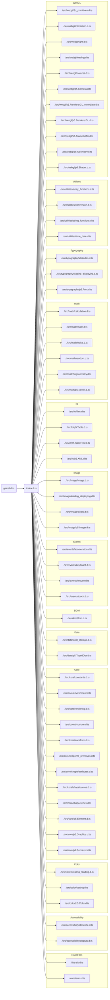

Here's the 60+ file tree you get when you start to load the global.d.ts and then index.d.ts from definitely typed.

```mermaid
flowchart LR
    Z("global.d.ts")
    A("index.d.ts")

    Z --> A

    subgraph Root Files
        R1[./literals.d.ts]
        R2[./constants.d.ts]
    end

    subgraph Accessibility
        Acc1[./src/accessibility/describe.d.ts]
        Acc2[./src/accessibility/outputs.d.ts]
    end

    subgraph Color
        Col1[./src/color/creating_reading.d.ts]
        Col2[./src/color/setting.d.ts]
        Col3[./src/color/p5.Color.d.ts]
    end

    subgraph Core
        Cor1[./src/core/constants.d.ts]
        Cor2[./src/core/environment.d.ts]
        Cor3[./src/core/rendering.d.ts]
        Cor4[./src/core/structure.d.ts]
        Cor5[./src/core/transform.d.ts]
        Cor6[./src/core/shape/2d_primitives.d.ts]
        Cor7[./src/core/shape/attributes.d.ts]
        Cor8[./src/core/shape/curves.d.ts]
        Cor9[./src/core/shape/vertex.d.ts]
        Cor10[./src/core/p5.Element.d.ts]
        Cor11[./src/core/p5.Graphics.d.ts]
        Cor12[./src/core/p5.Renderer.d.ts]
    end

    subgraph Data
        Dat1[./src/data/local_storage.d.ts]
        Dat2[./src/data/p5.TypedDict.d.ts]
    end

    subgraph DOM
        Dom1[./src/dom/dom.d.ts]
    end

    subgraph Events
        Evt1[./src/events/acceleration.d.ts]
        Evt2[./src/events/keyboard.d.ts]
        Evt3[./src/events/mouse.d.ts]
        Evt4[./src/events/touch.d.ts]
    end

    subgraph Image
        Img1[./src/image/image.d.ts]
        Img2[./src/image/loading_displaying.d.ts]
        Img3[./src/image/pixels.d.ts]
        Img4[./src/image/p5.Image.d.ts]
    end

    subgraph IO
        Io1[./src/io/files.d.ts]
        Io2[./src/io/p5.Table.d.ts]
        Io3[./src/io/p5.TableRow.d.ts]
        Io4[./src/io/p5.XML.d.ts]
    end

    subgraph Math
        Mat1[./src/math/calculation.d.ts]
        Mat2[./src/math/math.d.ts]
        Mat3[./src/math/noise.d.ts]
        Mat4[./src/math/random.d.ts]
        Mat5[./src/math/trigonometry.d.ts]
        Mat6[./src/math/p5.Vector.d.ts]
    end

    subgraph Typography
        Typ1[./src/typography/attributes.d.ts]
        Typ2[./src/typography/loading_displaying.d.ts]
        Typ3[./src/typography/p5.Font.d.ts]
    end

    subgraph Utilities
        Utl1[./src/utilities/array_functions.d.ts]
        Utl2[./src/utilities/conversion.d.ts]
        Utl3[./src/utilities/string_functions.d.ts]
        Utl4[./src/utilities/time_date.d.ts]
    end

    subgraph WebGL
        Web1[./src/webgl/3d_primitives.d.ts]
        Web2[./src/webgl/interaction.d.ts]
        Web3[./src/webgl/light.d.ts]
        Web4[./src/webgl/loading.d.ts]
        Web5[./src/webgl/material.d.ts]
        Web6[./src/webgl/p5.Camera.d.ts]
        Web7[./src/webgl/p5.RendererGL.Immediate.d.ts]
        Web8[./src/webgl/p5.RendererGL.d.ts]
        Web9[./src/webgl/p5.Framebuffer.d.ts]
        Web10[./src/webgl/p5.Geometry.d.ts]
        Web11[./src/webgl/p5.Shader.d.ts]
    end

    %% Connections
    A --> Acc1 & Acc2
    A --> Col1 & Col2 & Col3
    A --> Cor1 & Cor2 & Cor3 & Cor4 & Cor5 & Cor6 & Cor7 & Cor8 & Cor9 & Cor10 & Cor11 & Cor12
    A --> Dat1 & Dat2
    A --> Dom1
    A --> Evt1 & Evt2 & Evt3 & Evt4
    A --> Img1 & Img2 & Img3 & Img4
    A --> Io1 & Io2 & Io3 & Io4
    A --> Mat1 & Mat2 & Mat3 & Mat4 & Mat5 & Mat6
    A --> Typ1 & Typ2 & Typ3
    A --> Utl1 & Utl2 & Utl3 & Utl4
    A --> Web1 & Web2 & Web3 & Web4 & Web5 & Web6 & Web7 & Web8 & Web9 & Web10 & Web11
    A --> R1 & R2
```
